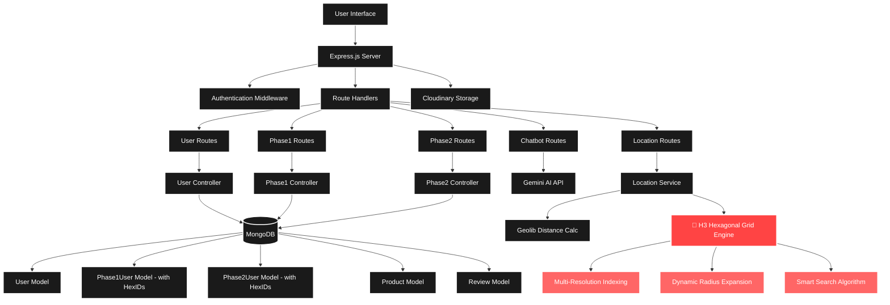

<h1 align="center">🚀 JunkJet - Optimized Waste Management Platform</h1>

<p align="center">
<b>AI-powered waste management platform connecting sellers, buyers, and recyclers with spatially optimized search and chatbot assistance.</b>
</p>

<p align="center">
  
  
  
  
</p>

---

## Table of Contents
- [🎯 Overview](#overview)
- [✨ Features](#features)
- [🏗️ Architecture](#architecture)
- [🛠️ Tech Stack](#tech-stack)
- [📦 Installation](#installation)
- [🚀 Usage](#usage)
- [📋 API Endpoints](#api-endpoints)
- [🌐 Deployment](#deployment)
- [🔮 Future Enhancements](#future-enhancements)
- [🤝 Contributing](#contributing)


---

## Overview

JunkJet is a modern waste management platform that connects waste generators with buyers and recyclers through an intelligent matching system. The platform uses advanced geospatial algorithms and AI to optimize waste trading efficiency.

### Key Components
- **Frontend**: Multi-phase web interface for different user types
- **Backend**: RESTful API with Express.js and MongoDB
- **AI Chatbot**: Gemini AI integration for natural language queries
- **Location Engine**: H3 hexagonal grid system for precise spatial matching
- **Authentication**: JWT-based secure user management

### User Phases
1. **Phase 1 (Individual Sellers)**: Households and small-scale waste generators
2. **Phase 2 (Organizations)**: Middle buyers, waste management companies
3. **Phase 3 (Large Recyclers)**: Industrial-scale recycling facilities

## Architecture


## 🎬 Demo & Screenshots

### Main Interface
The platform features a clean, responsive design with integrated chatbot support:


### Architecture Visualization


## 🔷 Hexagonal Grid Engine

### Why Hexagonal Grid?
JunkJet's core innovation is its **H3 Hexagonal Grid Engine** - a spatial indexing system that provides superior location matching compared to traditional square grids:

- **Equal Distance Neighbors**: All 6 neighbors are equidistant, eliminating diagonal distortions
- **No Blind Spots**: Complete coverage without gaps or overlaps
- **Efficient Expansion**: Smooth outward search patterns for optimal performance
- **Multi-Resolution**: Supports resolutions 4-8 for varying precision levels

### How It Works
```
Resolution 8 (High Precision) → Resolution 4 (Broader Area)
    🔷          🔷🔷🔷
   🔷🔷🔷   →   🔷🔷🔷
    🔷          🔷🔷🔷
```

1. **Initial Indexing**: User locations converted to H3 hex indexes at multiple resolutions
2. **Smart Search**: Starts at highest resolution (8) for precise matches
3. **Dynamic Expansion**: Expands search radius in 35-unit increments
4. **Resolution Fallback**: Drops to lower resolutions (7,6,5,4) if needed
5. **Distance Validation**: Final filtering using Geolib for exact distances

## Features

### 🔷 Hexagonal Grid Engine (Core Innovation)
- **Multi-Resolution H3 Indexing:** Spatial indexing at resolutions 4-8 for varying precision
- **Smart Search Algorithm:** Starts precise, expands intelligently
- **Dynamic Radius Expansion:** Incremental search radius growth (35-unit steps)
- **No Blind Spots:** Complete spatial coverage with hexagonal tessellation
- **Distance Optimization:** Geolib integration for precise distance calculations

### Core Functionality
- **AI-Powered Chatbot:** Gemini AI integration for natural language queries and buyer finding
- **Three-Phase User System:**
  - *Phase 1:* Individual sellers with household address registration
  - *Phase 2:* Organizations/middle buyers with business details
  - *Phase 3:* Large-scale recyclers and industrial buyers

### Technical Features
- **JWT Authentication:** Secure token-based authentication with refresh tokens
- **File Upload System:** Cloudinary integration for avatar and cover image storage
- **Responsive UI:** Multi-phase interface with integrated chatbot
- **Material Type Filtering:** Support for various waste material categories
- **Range-based Search:** Configurable search radius (1-5 km to 2000+ km)
- **Real-time Location Services:** GPS-based location detection and mapping

### Search Algorithm
- **Hexagonal Grid Expansion:** Starts with high resolution (8) and expands to lower resolutions (4)
- **Radius Expansion:** Incrementally increases search radius by 35 units per iteration
- **Distance Filtering:** Filters results based on user-specified maximum distance
- **Sorted Results:** Returns buyers sorted by proximity to seller


## Tech Stack

### Backend
- **Runtime:** Node.js with ES6 modules
- **Framework:** Express.js with CORS support
- **Database:** MongoDB with Mongoose ODM
- **Authentication:** JWT (jsonwebtoken) with bcrypt password hashing
- **File Upload:** Multer middleware with Cloudinary storage
- **Geospatial:** 
  - H3-js for hexagonal grid indexing
  - Geolib for precise distance calculations
- **AI Integration:** Google Gemini API for chatbot functionality
- **Validation:** Validator.js and Yup for input validation

### Frontend
- **Languages:** HTML5, CSS3, Vanilla JavaScript
- **UI Framework:** Custom responsive design
- **Icons:** Font Awesome 6.4.0
- **Architecture:** Multi-page application (Phase 1, 2, 3 interfaces)

### Development Tools
- **Process Manager:** Nodemon for development
- **Environment:** Dotenv for configuration management
- **Package Manager:** NPM

### External Services
- **AI:** Google Gemini 1.5 Flash API
- **Storage:** Cloudinary for image hosting
- **Maps:** Google Maps integration for location URLs

## Installation

### Prerequisites
- Node.js (v14 or higher)
- MongoDB database
- Cloudinary account for image storage
- Google Gemini API key

### Setup Steps
1. **Clone the repository:**
   ```bash
   git clone https://github.com/kishanravi887321/JunkJet_webapplication.git
   cd JunkJet_webapplication
   ```

2. **Install dependencies:**
   ```bash
   npm install
   ```

3. **Environment Configuration:**
   Create `.env` and `main.env` files in the root directory:
   ```env
   # Database
   DB_URL=mongodb://localhost:27017/junkjet
   
   # JWT Secrets
   ACCESS_TOKEN_SECRET=your_access_token_secret
   REFRESH_TOKEN_SECRET=your_refresh_token_secret
   ACCESS_TOKEN_EXPIRY=1d
   REFRESH_TOKEN_EXPIRY=10d
   
   # Cloudinary
   CLOUDINARY_CLOUD_NAME=your_cloud_name
   CLOUDINARY_API_KEY=your_api_key
   CLOUDINARY_API_SECRET=your_api_secret
   
   # Gemini AI
   GEMINI_API_KEY=your_gemini_api_key
   
   # Server
   PORT=8000
   ```

4. **Start the development server:**
   ```bash
   npm run dev
   ```

5. **Access the application:**
   - Backend API: `http://localhost:8000`
   - Frontend UI: Open `junkjet-ui/index.html` in your browser

## Usage

### For Individual Sellers (Phase 1)
1. Register a user account with avatar/cover image
2. Complete Phase 1 registration with your household address
3. Use the chatbot to find nearby buyers for your waste materials
4. Specify material type and search range

### For Organizations (Phase 2)
1. Register a user account
2. Complete Phase 2 registration with organization details
3. Set up your business location and material preferences
4. Receive inquiries from Phase 1 sellers in your area

### Chatbot Features
- Natural language material type queries
- Location-based buyer/seller finding
- Support for various waste categories
- Dynamic range specification (e.g., "1-5 km", "30-50 km")

## Project Structure

```
JunkJet/
├── src/
│   ├── app.js                 # Express app configuration
│   ├── index.js              # Server entry point
│   ├── controllers/          # Request handlers
│   ├── models/               # MongoDB schemas
│   ├── routes/               # API route definitions
│   ├── services/             # Business logic
│   ├── middlewares/          # Custom middleware
│   ├── utils/                # Utility functions
│   ├── chatbot/              # AI chatbot logic
│   └── db/                   # Database connection
├── junkjet-ui/               # Frontend application
│   ├── css/                  # Stylesheets
│   ├── js/                   # Client-side JavaScript
│   ├── index.html            # Main page
│   ├── phase1.html           # Individual seller interface
│   ├── phase2.html           # Organization interface
│   └── phase3.html           # Large recycler interface
└── package.json              # Dependencies and scripts
```

## API Endpoints

### User Management
- `POST /api/users/register` - Register a new user with avatar/cover image
- `POST /api/users/login` - Authenticate user and issue JWT token
- `PUT /api/users/changepassword` - Update user password (authenticated)
- `POST /api/users/deleteavatar` - Delete user avatar (authenticated)
- `POST /api/users/updateavatar` - Update user avatar (authenticated)
- `PUT /api/users/updateuserdetails` - Update user details (authenticated)

### Phase Registration
- `POST /phase1/register` - Register Phase 1 user (individual seller) with address
- `POST /phase2/update` - Update Phase 2 user (organization) details

### Location & Search
- `POST /location/finduser` - Find nearest buyers using hexagonal grid search
  - Parameters: `email`, `materialType`, `rangeKm`
  - Returns: Array of matched buyers with distances

### AI Chatbot
- `POST /chatbot/chatbotquery` - Process chatbot queries with Gemini AI
  - Includes prompt validation middleware
  - Supports location-based buyer finding
  - Natural language processing for waste material queries

### Products & Reviews
- Product management endpoints (via `/product` routes)
- Review system endpoints (via `/review` routes)

## Deployment
Backend is deployed on Render for scalability and reliability.

## Future Enhancements
- Real-time updates via WebSockets
- Predictive analytics for waste demand
- Expanded chatbot capabilities

## Contributing
Contributions are welcome! Please open issues and submit pull requests to improve the system.


<p align="center">
Made with ❤️ by <a href="https://github.com/kishanravi887321">Ravi Kishan</a>
</p>

,